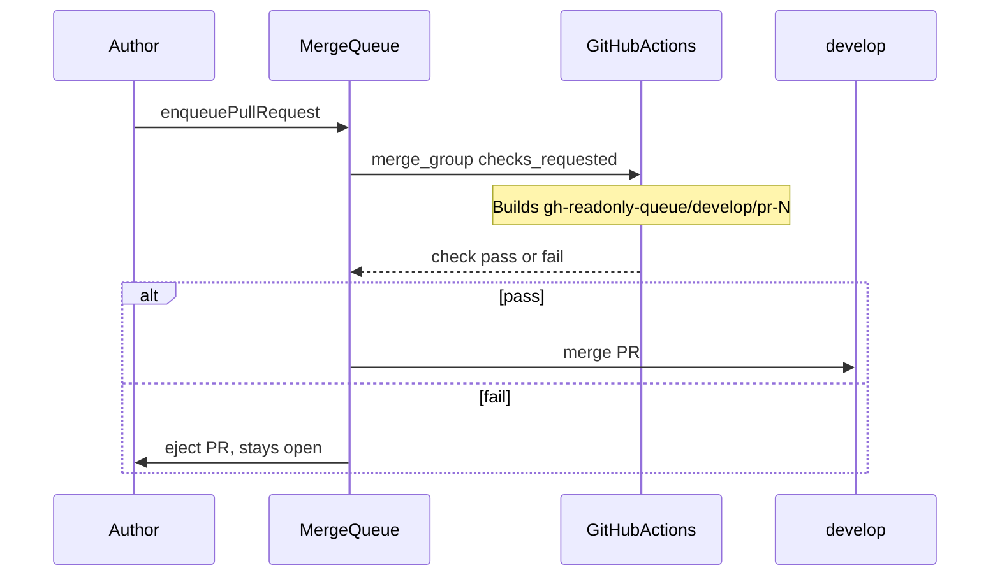

# Merge Queue + Manual Stacked PR — Experiment Report

**Date:** 2026-06-09  
**Repo:** https://github.com/STWorlds/merge-queue-stack-test  
**Org:** [STWorlds](https://github.com/STWorlds) (free org, public repo)  
**Default branch:** `develop`  
**Local clone:** `~/sandbox/merge-queue-stack-test`

---

## Executive summary

We ran a two-phase experiment to answer:

1. **Does GitHub merge queue replace clicking "Update branch"?**
2. **Can manually stacked PRs land smoothly through the queue?**

| Question | Without merge queue (personal account) | With merge queue (STWorlds org) |
|----------|----------------------------------------|----------------------------------|
| Update branch required? | **Yes** — PRs go `BEHIND` and merge is blocked | **No** — queue builds on latest `develop` + `merge_group` CI |
| Two parallel PRs land smoothly? | **No** — second PR needs manual update | **Yes** — FIFO queue, both merged with 0 Update branch clicks |
| `merge_group` failure handling? | Not testable | **Yes** — failing PR ejected, stays open |
| Manual stacked PRs via queue? | **No** | **No** — still need change base + update branch on top PR |

**Recommendation:** Enable merge queue on org-owned integration branches. For true stacked-PR workflow, pursue [GitHub Stacked PRs](https://github.github.com/gh-stack/) (`gh-stack` preview) in addition to merge queue.

---

## Infrastructure

### Branch protection (ruleset `develop-protection`)

- Require pull request before merging
- Required status check: `check` (from `.github/workflows/ci.yml`)
- `strict_required_status_checks_policy: true` (branch must be up to date — unless merge queue handles it)
- **Merge queue** (org repo only): `ALLGREEN`, merge method `MERGE`, build concurrency 5

### CI workflow

[`.github/workflows/ci.yml`](.github/workflows/ci.yml) triggers on:

| Event | Purpose |
|-------|---------|
| `pull_request` → `develop` | Run 1 — validate PR branch in isolation |
| `merge_group` + `checks_requested` | Run 2 — validate temporary `gh-readonly-queue/develop/pr-N` commit before merge |

Optional experiment guards fail `merge_group` when specific marker files are **newly added** in the merge diff (not when already on `develop`).

### Helper scripts

| Script | Purpose |
|--------|---------|
| [`scripts/enable-merge-queue.sh`](scripts/enable-merge-queue.sh) | Create merge-queue ruleset on an org repo |
| [`scripts/enqueue-pr.sh`](scripts/enqueue-pr.sh) | Add PR to queue via `enqueuePullRequest` GraphQL |

**CLI note:** `gh pr merge` may fail on ruleset-based queues unless `allow_auto_merge` is enabled on the repo. Use `enqueue-pr.sh` instead ([cli#13398](https://github.com/cli/cli/issues/13398)).

---

## Phase 1 — Personal account (`adsteventir`)

Merge queue **cannot** be enabled on personal-account repos. The REST API returns `422 Invalid rule 'merge_queue'`. See [ORG-SETUP.md](ORG-SETUP.md).

| Item | Result |
|------|--------|
| `merge_queue` ruleset | **Rejected** |
| `merge_group` workflow runs | **0** |
| Queue UI / "Merge when ready" | **Not available** |

### Scenario A — Single PR + trunk drift

| Observation | Result |
|-------------|--------|
| PR | [#2](https://github.com/STWorlds/merge-queue-stack-test/pull/2) `feat/a` → `develop` |
| Decoy merged first | [#3](https://github.com/STWorlds/merge-queue-stack-test/pull/3) advanced `develop` |
| `mergeStateStatus` after drift | **BEHIND** |
| Merge without Update branch | **Blocked** — `head branch is not up to date with the base branch` |
| Update branch clicks | **1 required** |

### Scenario B — Two parallel PRs

| Observation | Result |
|-------------|--------|
| PRs | [#4](https://github.com/STWorlds/merge-queue-stack-test/pull/4) B1, [#5](https://github.com/STWorlds/merge-queue-stack-test/pull/5) B2 |
| B1 merged (squash) | Success |
| B2 after B1 landed | **BEHIND** — merge blocked without update |
| Update branch clicks | **1** on B2 |

### Scenario C — Manual stacked PRs

**C2 — Try to queue whole stack**

| PR | Base | Result |
|----|------|--------|
| [#6](https://github.com/STWorlds/merge-queue-stack-test/pull/6) | `develop` | Merged (squash + **delete branch**) |
| [#7](https://github.com/STWorlds/merge-queue-stack-test/pull/7) | `feat/layer-1` | **Closed** when base branch deleted — `DIRTY` / `CONFLICTING` |

Top PR cannot enter `develop`'s queue (wrong base). Deleting the stack base branch on merge breaks the top PR.

**C3 — Sequential landing (workable manual path)**

| Step | PR | Result |
|------|-----|--------|
| Open stack | [#8](https://github.com/STWorlds/merge-queue-stack-test/pull/8), [#9](https://github.com/STWorlds/merge-queue-stack-test/pull/9) | PR-2 base = `feat/layer-1b` |
| Merge PR-1 | #8 squash, **keep** base branch | OK |
| Change base → `develop` | #9 | Diff showed both files until update-branch |
| `gh pr update-branch` | #9 | Diff narrowed to `layer2b.txt` only |
| Merge PR-2 | #9 | **Success** |

**Manual steps for smooth stack land:** (1) merge bottom without deleting base, (2) change base to `develop`, (3) update branch, (4) wait CI, (5) merge.

**Mid-stack CI gap:** PRs targeting `feat/layer-*` did not run the `check` workflow — only PRs targeting `develop` trigger it in our setup.

### Scenario D — Baseline

With strict up-to-date checks and **no** merge queue, every drifted PR shows **BEHIND** and blocks merge until Update branch. Phase 1 *is* this baseline.

### Scenario E — Failure guards (not testable without queue)

| Sub-scenario | PR | `pull_request` | `merge_group` | Outcome |
|--------------|-----|----------------|---------------|---------|
| E1 solo marker | [#10](https://github.com/STWorlds/merge-queue-stack-test/pull/10) | Pass | Not run | Direct squash merge — guard never executed |
| E2 combined markers | [#11](https://github.com/STWorlds/merge-queue-stack-test/pull/11), [#12](https://github.com/STWorlds/merge-queue-stack-test/pull/12) | Pass each | Not run | B1 merged; B2 **BEHIND** |

---

## Phase 2 — STWorlds org (merge queue enabled)

After transferring to [STWorlds](https://github.com/STWorlds), merge queue was enabled via ruleset. Org transfer confirmed: **free org + public repo = merge queue works**, no paid plan required ([GitHub blog](https://github.blog/news-insights/product-news/github-merge-queue-is-generally-available/)).

### Scenario A — Drift without Update branch ✅

| Step | Result |
|------|--------|
| [#14 MQ-A](https://github.com/STWorlds/merge-queue-stack-test/pull/14) opened | `pull_request` CI pass |
| [#15 decoy](https://github.com/STWorlds/merge-queue-stack-test/pull/15) merged via queue | `develop` advanced |
| Queue #14 **without** `gh pr update-branch` | **Merged** |
| `merge_group` CI | **Pass** on `gh-readonly-queue/develop/pr-14-...` |

### Scenario B — Two PRs in queue ✅

| PR | Result |
|----|--------|
| [#17 MQ-B1](https://github.com/STWorlds/merge-queue-stack-test/pull/17) | Queued first → `merge_group` pass → merged |
| [#18 MQ-B2](https://github.com/STWorlds/merge-queue-stack-test/pull/18) | Queued second → `merge_group` pass (included B1) → merged |
| Update branch clicks | **0** |

### Scenario E1 — Solo `merge_group` failure ✅

| PR | `pull_request` | `merge_group` | Queue outcome |
|----|----------------|---------------|---------------|
| [#20 MQ-E1](https://github.com/STWorlds/merge-queue-stack-test/pull/20) `.mq-e1-fail` | Pass | **Fail** | **Ejected** — PR stays **OPEN**, `develop` unchanged |

### Scenario E2 — Combined batch failure (partial)

| PR | Result |
|----|--------|
| [#21 MQ-E2A](https://github.com/STWorlds/merge-queue-stack-test/pull/21) `.mq-e2-a` | Solo `merge_group` pass → **merged** |
| [#22 MQ-E2B](https://github.com/STWorlds/merge-queue-stack-test/pull/22) `.mq-e2-b` | Solo `merge_group` pass → **merged** |

Combined guard (both markers in one `merge_group` diff) did **not** trigger — the queue validated and merged #21 before building the combined group for #22. To test combined failure: put both markers on **one PR**, or raise `min_entries_to_merge` so both land in the same batch.

### Scenario C — Stacked PRs (not re-run on org)

Expected behavior unchanged from Phase 1: merge queue only accepts PRs whose base is `develop`. Manual stacks still require the C3 choreography. Native stack-aware queue needs [GitHub Stacked PRs](https://github.github.com/gh-stack/).

---

## Verdict rubric (combined)

| Scenario | Phase 1 (no queue) | Phase 2 (merge queue) |
|----------|--------------------|------------------------|
| A — drift | Update branch **required** | Update branch **not needed** ✅ |
| B — parallel PRs | Survivor needs update | Both merge, 0 updates ✅ |
| C — manual stack | Change base + update branch | Same (not queue-friendly) |
| E1 — solo `merge_group` fail | Not tested | Ejected from queue ✅ |
| E2 — combined fail | Not tested | Solo merges only (partial) |
| D — baseline | Strict = BEHIND without update | N/A |

---

## How merge queue works (observed)

**Two CI runs per PR (happy path):**

1. `pull_request` — your branch alone
2. `merge_group` — your changes on latest `develop` (+ queued PRs ahead)

That second run is what replaces Update branch + re-running CI manually.

---

## Recommendations

1. **Use merge queue** on org-owned public repos for integration branches with high PR volume.
2. **Keep `merge_group` in CI** — without it, queued merges stall waiting for required checks.
3. **Use `enqueue-pr.sh`** when `gh pr merge` fails on ruleset-based queues.
4. **Manual stacked PRs:** do not delete the stack base branch on merge; plan for change base + update branch on the top PR.
5. **For stacking at scale:** join the [Stacked PRs waitlist](https://github.github.com/gh-stack/) — merge queue + `gh-stack` is the path to stack-aware review, CI, and landing.

---

## Appendix — Key PR index

| Phase | Scenario | PRs |
|-------|----------|-----|
| 1 | A drift | [#2](https://github.com/STWorlds/merge-queue-stack-test/pull/2), [#3](https://github.com/STWorlds/merge-queue-stack-test/pull/3) |
| 1 | B parallel | [#4](https://github.com/STWorlds/merge-queue-stack-test/pull/4), [#5](https://github.com/STWorlds/merge-queue-stack-test/pull/5) |
| 1 | C stack | [#6](https://github.com/STWorlds/merge-queue-stack-test/pull/6)–[#9](https://github.com/STWorlds/merge-queue-stack-test/pull/9) |
| 1 | E guards | [#10](https://github.com/STWorlds/merge-queue-stack-test/pull/10)–[#12](https://github.com/STWorlds/merge-queue-stack-test/pull/12) |
| 2 | A drift | [#14](https://github.com/STWorlds/merge-queue-stack-test/pull/14), [#15](https://github.com/STWorlds/merge-queue-stack-test/pull/15) |
| 2 | B parallel | [#17](https://github.com/STWorlds/merge-queue-stack-test/pull/17), [#18](https://github.com/STWorlds/merge-queue-stack-test/pull/18) |
| 2 | E failure | [#20](https://github.com/STWorlds/merge-queue-stack-test/pull/20)–[#22](https://github.com/STWorlds/merge-queue-stack-test/pull/22) |
| Infra | CI fix, docs | [#16](https://github.com/STWorlds/merge-queue-stack-test/pull/16), [#19](https://github.com/STWorlds/merge-queue-stack-test/pull/19), [#23](https://github.com/STWorlds/merge-queue-stack-test/pull/23) |

---

## Superseded documents

This report consolidates:

- `OBSERVATIONS.md` — Phase 1 (personal account)
- `MQ-OBSERVATIONS.md` — Phase 2 (STWorlds org)

Those files remain in the repo for history; **REPORT.md** is the canonical summary.
